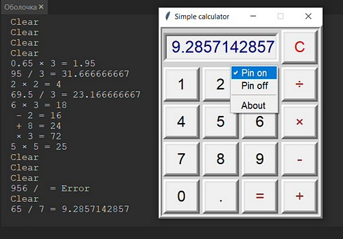

# Simple-calculator
Can be docked on top of all windows.  
You can copy the result to the clipboard.  
You can make calculations from the keyboard.  
Human-readable console output of the process.  
calculator.exe - Python assembly of everything you need to easily run 
                 under Windows without installing a programming environment.

